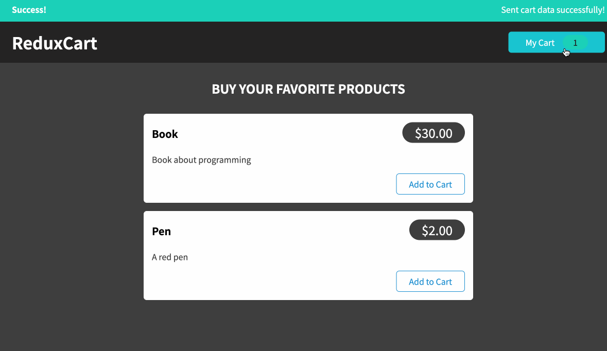

<h1>Redux Cart</h1>

<a href="https://github.com/dieegomr/redux-cart/blob/main/README_pt-BR.md">README.md</a> em português

This is a application where a user can manage a shopping cart.

Redux Cart is part of <a href="https://www.udemy.com/course/react-the-complete-guide-incl-redux/">"React - The Complete Guide (incl Hooks, React Router, Redux)"</a>.

It was the a project of the course where it was possible to practice state management using Redux.

<h3>Things I have practiced with this project:</h3>
<ul>
<li>How Redux Works</li>
<li>Creating a Redux Store</li>
<li>Providing the store Store</li>
<li>Attaching Payloads to Actions</li>
<li>Working with Multiple State Properties</li>
<li>Redux Toolkit</li>
<li>Redux & Async Code</li>
<li>Handling Http States & Feedback with Redux</li>
<li>Redux DevTools</li>
</ul>

<h3>Sample:</h3>

Click <a href="https://carrinho-redux.netlify.app" target="_blank">here!</a> to access the website

<h3>How to run this website?</h3>

 1) Clone the repository 

     $ git clone https://github.com/dieegomr/redux-cart.git

 2) Open the project folder on the terminal and run the following command

     $ npm install

     $ npm start

 3) Check the message: "Server will be running at http://localhost:XXXX"

 4) Copy and paste the link on your Browser

