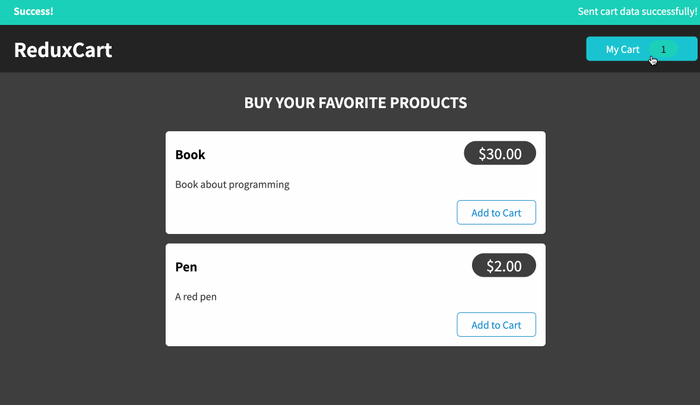

<h1>Carrinho Redux</h1>

<a href="https://github.com/dieegomr/redux-cart/blob/main/README.md">README.md</a> in english

Este é um aplicativo onde um usuário pode gerenciar um carrinho de compras.

Redux Cart faz parte do <a href="https://www.udemy.com/course/react-the-complete-guide-incl-redux/">"React - The Complete Guide (incl Hooks, React Roteador, Redux)"</a>.

Foi um desafio de projeto do curso onde foi possível praticar a gestão de estados utilizando Redux.

<h3>O que foi praticado com este projeto?</h3>
<ul>
<li>Como funciona o Redux</li>
<li>Criando Redux Store</li>
<li>Disponibilizando Redux Store</li>
<li>Payloads and Actions</li>
<li>Trabalhando com várias State Properties</li>
<li>Redux Toolkit</li>
<li>Redux com código assíncrono</li>
<li>Como lidar com estados de HTTP e feedback com o Redux</li>
<li>Redux Devtools</li>
</ul>

<h3>Amostra:</h3>

Clique <a href="https://carrinho-redux.netlify.app" target="_blank">aqui!</a> para acessar o site

<h3>Como rodar este site no seu pc:</h3>

 1) Clone o repositório 

 $ git clone https://github.com/dieegomr/redux-cart.git

 2) Abra a pasta do projeto no terminal e execute o seguinte comando

 $ npm instalar

 $ npm inicial

 3) Verifique a mensagem: "O servidor será executado em http://localhost:XXXX"

 4) Copie e cole o link no seu navegador

